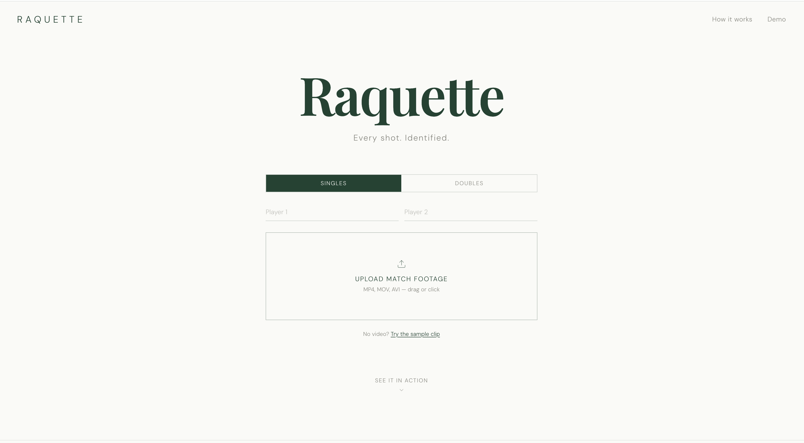
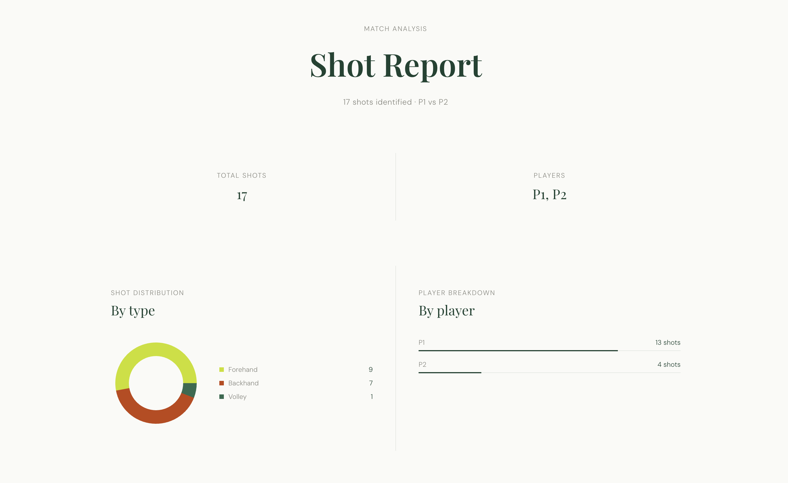

# Raquette

### AI Tennis Shot Identifier

Upload match footage. Get a timestamped breakdown of every shot — type, player, and moment of contact.

**[View Live App](https://raquette.vercel.app)**&nbsp;&nbsp;·&nbsp;&nbsp;**[Explore the code](https://github.com/LightAnd2/raquette)**&nbsp;&nbsp;·&nbsp;&nbsp;**[Report Bug](https://github.com/LightAnd2/raquette/issues)**





---

## About

Raquette is a full-stack AI application that identifies tennis shot types from match footage. Upload an MP4, enter player names, and get a shot-by-shot timeline — every forehand, backhand, serve, return, volley, and smash, attributed to the right player with timestamps.

**Why I built it**

- Coaching analytics tools cost thousands and require proprietary hardware
- Public match video has no structured shot data attached
- I wanted a pipeline that turns any match recording into structured insight

---

## How It Works

Three models run in sequence on every processed frame:

| Step | Model | What it does |
|------|-------|-------------|
| 01 | **YOLOv8n** | Detects players, filters out ball boys and spectators by bounding box size and confidence |
| 02 | **MediaPipe Pose** | Extracts 33 body landmarks per player — shoulder rotation, hip alignment, wrist angle |
| 03 | **ServeDetector + RallyClassifier** | Two temporal CNNs: one binary (serve vs not), one 4-class (forehand / backhand / volley / smash). A state machine infers return contextually |

A centroid-based re-identification tracker keeps each player's identity consistent across frames.

**Model accuracy** (748 labeled sequences, trained on Kaggle T4 GPU)

| Model | Val Accuracy |
|-------|-------------|
| ServeDetector | 96.4% |
| RallyClassifier | 84.1% |

---

## Built With

**Frontend** — React + Vite · Tailwind CSS v4 · Framer Motion · Recharts · React Router

**Backend** — FastAPI · uvicorn

**ML** — YOLOv8n · MediaPipe Pose (Tasks API) · PyTorch (1D temporal CNN)

**Infrastructure** — Vercel (frontend) · Hugging Face Spaces (backend, Docker) · Hugging Face Hub (model weights)

---

## Getting Started

### Prerequisites

- Node.js 18+
- Python 3.11+

### Installation

```bash
git clone https://github.com/LightAnd2/raquette.git
cd raquette

# Python env
python -m venv .venv
source .venv/bin/activate
pip install -r backend/requirements.txt

# Frontend
cd frontend && npm install && cd ..

# Run both
./dev.sh
```

Open `http://localhost:5173`

---

## Usage

1. Go to [raquette.vercel.app](https://raquette.vercel.app)
2. Select **Singles** or **Doubles**
3. Enter player names (optional)
4. Drop in an MP4 of a match
5. Watch the live shot feed, then view the full breakdown

**Tips**
- Broadcast or behind-the-baseline angles work best
- Clips of 30s–2min process fastest on the free-tier backend
- Clear full-swing groundstrokes give the most accurate results

---

## Project Structure

```
raquette/
├── frontend/              # React + Vite app
│   └── src/
│       ├── pages/         # Landing, Analysis (live feed), Results
│       └── components/    # RallyTimeline, SampleAnalysis
│
├── backend/               # FastAPI server
│   └── app/
│       └── pipeline_worker.py  # ML pipeline + PlayerTracker + RallyStateMachine
│
├── ml/
│   ├── models/
│   │   ├── shot_classifier.py  # ServeDetector + RallyClassifier + _TennisCNN
│   │   └── weights/            # serve_detector.pt, rally_classifier.pt
│   └── train/
│       ├── extract_poses.py    # Pose extraction from labeled clips → poses.pkl
│       └── train.py            # Training script (run on Kaggle GPU)
│
└── hf-space/              # Hugging Face Spaces deployment
    ├── Dockerfile
    └── app.py             # FastAPI entry point + weight bootstrap
```

---

## Contact

**Andrew Koja** · [GitHub](https://github.com/LightAnd2) · [LinkedIn](https://linkedin.com/in/andrewkoja)
