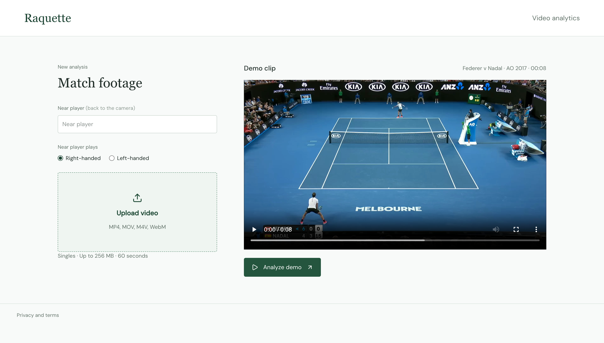
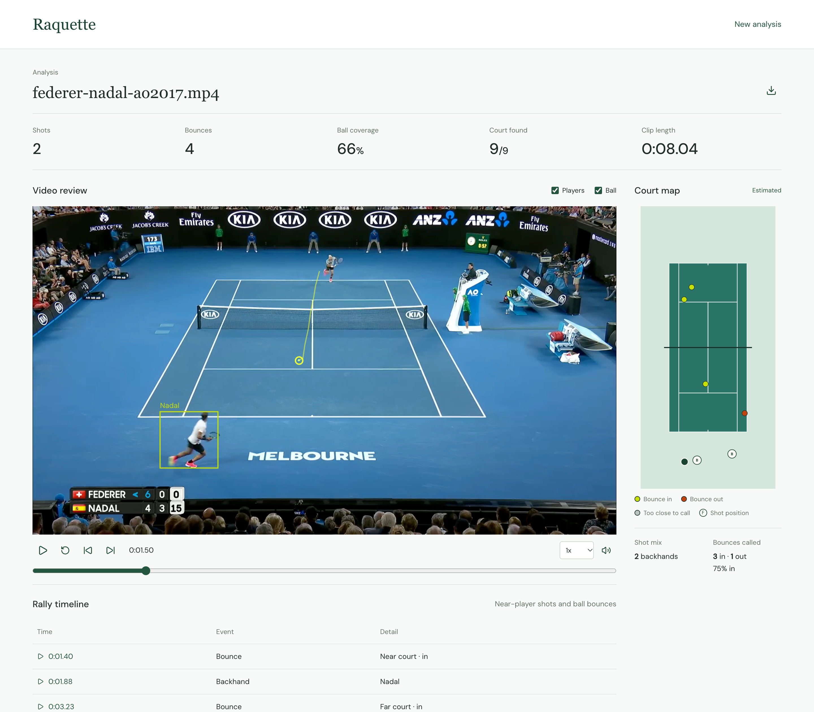

# Raquette

### AI Tennis Rally Analysis

Upload a broadcast rally. See the court, the near player, every bounce (in or out), and every serve, forehand and backhand they hit, on a top-down court map next to the video.

**[Try the Demo](https://raquette.vercel.app)**&nbsp;&nbsp;·&nbsp;&nbsp;**[Run It Locally](#run-it-locally)**&nbsp;&nbsp;·&nbsp;&nbsp;**[Report Bug](https://github.com/LightAnd2/raquette/issues)**

> **The live site is a demo.** It runs on free CPU hardware, so it accepts clips up to 15 seconds and takes about 1.5 minutes of processing per second of video. For full speed and clips up to 60 seconds, [run Raquette locally](#run-it-locally).

---



---

## About

Raquette turns broadcast tennis footage into structured rally data. Upload a clip and it finds the court lines, tracks the ball and the near-side player, detects bounces and hits, calls bounces in or out, and labels each shot as a serve, forehand or backhand, all mapped onto a top-down court next to the video.

**Why I built it**

- Coaching analytics tools cost thousands and require proprietary hardware
- Public match video has no structured shot data attached
- I wanted a pipeline that turns any match recording into structured insight

---

## How It Works

| Step | Model / method | What it does |
|------|----------------|--------------|
| 01 | **TrackNet** | Finds the ball in every frame from three consecutive frames |
| 02 | **Court detection** | TennisCourtDetector keypoints, with a painted-line fitter as fallback; maps image pixels to court metres. Replays and close-ups are ignored |
| 03 | **YOLOv8n** | Finds the near-side player and places their feet on the court |
| 04 | **Bounce classifier** | CatBoost model trained on this pipeline's own ball tracks; bounces are called in, out, or too close to call |
| 05 | **Hit detection** | The ball's path reverses beside the player, including contacts hidden in short tracking gaps |
| 06 | **Shot type** | Serve from the ball toss; forehand or backhand from the side of the body at contact and the player's handedness |

---

## Accuracy

Measured on broadcast footage the models never trained on: TrackNet dataset games 8 to 10 (5,675 labelled frames). Reproduce with `python scripts/eval_tracknet.py score`.

| | Found | Correct |
|---|---|---|
| Ball position (within 10 px) | 94.2% | 99.7% |
| Bounces (within 3 frames) | 82.5% | 96.2% |
| Near-player hits (within 4 frames) | 91.8% | 97.1% |

Shot types were checked by hand on 52 near-player shots from Australian Open and US Open broadcasts: forehand / backhand 46 of 48 correct, serves 4 of 4 with no false serves.

**Supported:** landscape TV broadcast footage, singles, the near-side player. Vertical clips (e.g. YouTube Shorts) get ball, player and shots but no court map.

---

## Speed

| Where it runs | Processing time |
|---|---|
| Free demo server (2 CPU cores) | about 95× the clip length (an 8 s clip takes about 13 min) |
| Apple Silicon Mac (GPU) | about 4 to 5× the clip length (an 8 s clip takes about 30 s) |

---

## Results



---

## Run It Locally

### Prerequisites

- Python 3.11+
- Node.js 18+
- An Apple Silicon Mac or an NVIDIA GPU for full speed (CPU works, but slowly)

### Install

```bash
git clone https://github.com/LightAnd2/raquette.git
cd raquette

# Python environment
python -m venv .venv
source .venv/bin/activate
pip install -r backend/requirements.txt

# Model weights (the three large public models, about 85 MB)
python scripts/download_weights.py

# Frontend
cd frontend && npm install && cd ..
```

### Run

```bash
./dev.sh
```

Open `http://localhost:5173`. Local runs accept clips up to 60 seconds. For longer clips, raise the upload limit:

```bash
RAQUETTE_MAX_SECONDS=180 ./dev.sh
```

The limit only applies to uploads in the web app; the pipeline itself has no length limit.

---

## Usage

1. Choose whether the near player is right- or left-handed
2. Upload a broadcast clip (MP4, MOV, M4V or WebM)
3. Review the video with tracking overlays, the shot map, rally stats, and the rally timeline

**Tips**

- The standard broadcast angle (high, behind the baseline) works best
- One rally per clip gives the cleanest timeline

---

## Built With

**Frontend**: React + Vite · Tailwind CSS v4 · React Router

**Backend**: FastAPI · uvicorn

**ML**: TrackNet · TennisCourtDetector · YOLOv8n · CatBoost · MediaPipe Pose · PyTorch

**Infrastructure**: Vercel (frontend) · Hugging Face Spaces (demo backend, Docker)

---

## Project Structure

```
raquette/
├── frontend/                      # React + Vite app
│   └── src/pages/                 # Landing (upload), Analysis (progress), Results
│
├── backend/app/
│   ├── main.py                    # FastAPI: upload, jobs, results, video streaming
│   ├── analytics.py               # Court, ball, player, bounce and hit pipeline
│   └── shots.py                   # Shot types and handedness
│
├── ml/
│   ├── tennis_analysis/           # TrackNet and bounce detector code
│   ├── models/shot_classifier.py  # Pose-based ServeDetector + RallyClassifier
│   └── models/weights/            # Model weights
│
├── scripts/
│   ├── download_weights.py        # Fetch the large public model weights
│   ├── eval_tracknet.py           # Accuracy on held-out TrackNet games
│   ├── train_bounce.py            # Train the bounce classifier
│   └── split_rallies.py           # Cut a full match video into rally clips
│
└── deployment/spaces/             # Hugging Face Spaces demo (build.sh assembles it)
```

---

## Credits

- **TrackNet**: Huang et al., "TrackNet: A Deep Learning Network for Tracking High-speed and Tiny Objects in Sports Applications" (2019); weights from the PyTorch implementation by yastrebksv
- **TennisCourtDetector** and the original bounce regressor: yastrebksv
- **YOLOv8**: Ultralytics
- **MediaPipe Pose**: Google

---

## Contact

**Andrew Koja** · [GitHub](https://github.com/LightAnd2) · [LinkedIn](https://linkedin.com/in/andrewkoja)
